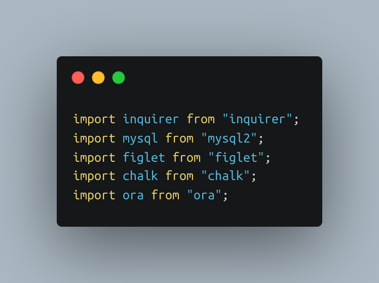
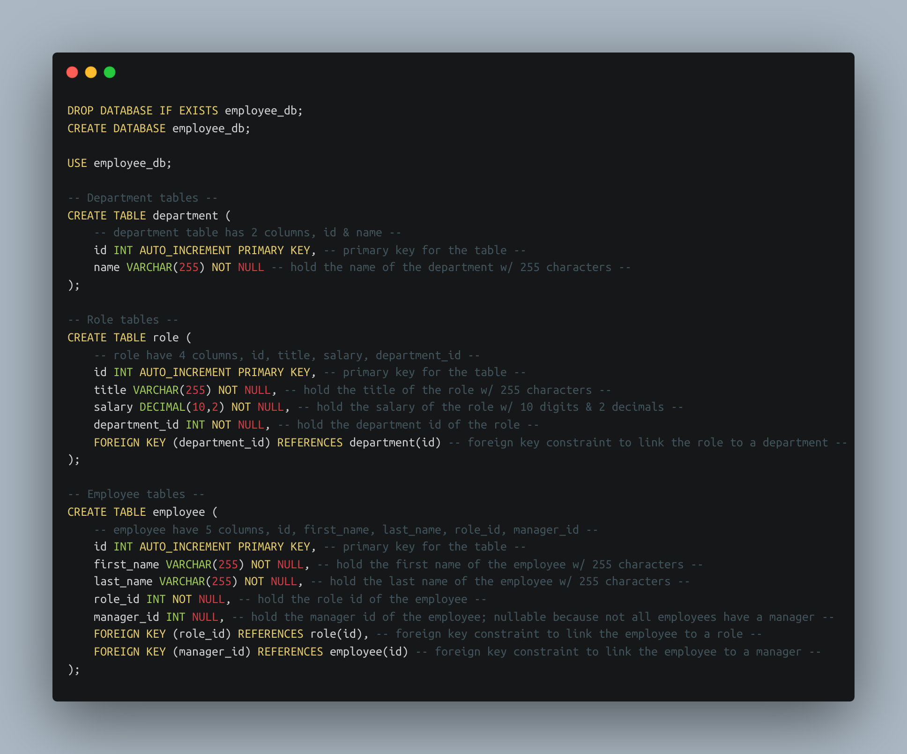

# Employee_Tracker

### Video Demo

### Description

I am thrilled to present to you my latest project - an Employee Tracker application. This is a command-line interface application built using Node.js and several powerful npm packages such as Inquirer, MySQL, console.table, figlet, chalk, and ora.

### Functionality

This Employee Tracker application users to interact with a MYSQL database containing information about employees, departments, and roles within an organization. Using a series of SQL queries, users can view, add, and update employee information with ease.

The main menu of the application provides users with a list of options to choose from, including viewing employees, departments, and roles, adding new employees, departments, and roles, updating employee roles and departments, resetting the database, and exiting the application. The application uses console.table to display data in a formatted table and chalk to provide colored text output, making it easy to read and navigate.

### NPM & Tools

